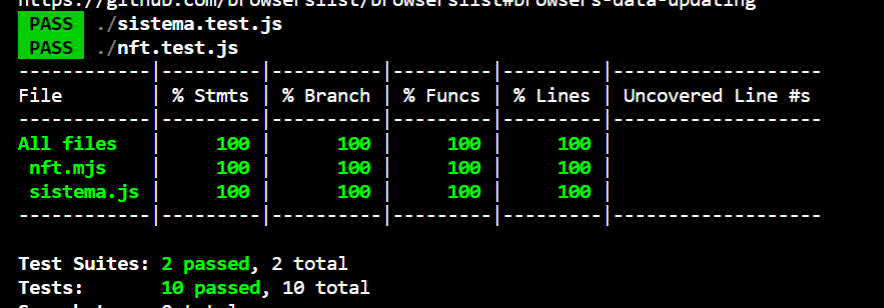
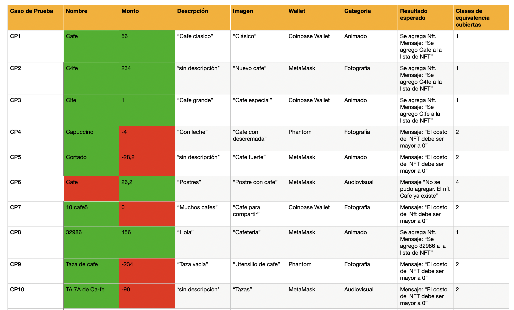

# Fundamentos de Ingeniería de Software - Obligatorio 2

| Identificación |                                                        |
|----------------|--------------------------------------------------------|
| Fecha          | 22/06/2022                                             |
| Clase          | M3B - Docente: Alejandro Adorjan                       |
| Integrantes    | Paula Lebed y Tamara Melnik                            |
| Link           | https://github.com/paulalebed/Lebed--Melnik.git        |

##INDICE
CONSTRUCION
**1.** Aspectos generales

**2.** Funciones principales implementadas: casos de uso 

**3.** Librerias externas

INTERFAZ DE USUARIO
**1.** Usabilidad
**2.** Estándar de accesibilidad WCAG
**3.** Especificación de estilo
**4.** Caracterísicas generales

CODIFICACIÓN
**1.** IDE: Visual Studio Code
**2.** Buenas prácticas para la Programación Orientada a Objetos

TEST UNITARIOS

TEST DE SISTEMA
**1.** Sobre la versión congelada 
**2.** Aplicación de la técnica partición equivalente a traves de los casos de prueba
**3.** Pruebas exploratorias

REPORTE DE ISSUES
**1.** Evaluación global de calidad

REFLEXIÓNES PERSONALES

PRESENTACIÓNES ORALES INDIVIDUALES
    

## CONSTRUCCIÓN

### Aspectos generales:

Para lograr construir el programa hicimos uso de dos diferentes carpetas, las cuales contienen la información: dominio e interfaz. Por un lado, en dominio, se puede encontrar lo que es la  funcionalidad del programa: aquello que es necesario para correr la lógica del mismo. Las clases utilizadas fueron **Sistema** y **Nft**. Además dentro del dominio tambien se pueden encontrar los archivos para probar el proyecto (Pruebas unitarias con Jest). Por otro lado, en interfaz, contamos con una carpeta que refiere a los estilos de nombre style.css y otra de scripts, llamada index.js, además del index.html. 

### Funciones principales:
#### Implementación

Para este prototipo decidimos realizar la implementación de las funcionalidades de los siguientes casos de uso especificados en la primer entrega:

### **ID:** CU2: Publicar NFT

**Referencias:** 
- Conexión con Wallet (RF1)
- Listar NFT para la venta (RF5)
- Login (RF9)

**Título:**  CU2

**Actor:** Sistema y Usuario

**Descripción:** El sistema deberá permitir a sus usuarios listar un NFT para la venta.

**Prioridad:** Alta

**Precondición:** El usuario deberá tener una cuenta creada en el marketplace y deberá estar correctamente logueado. Además, deberá tener su wallet relacionada a la misma. 

**Poscondición:** El usuario será capaz de listar sus piezas coleccionables para la venta y estarán disponibles en el catálogo para que los usuarios compradores puedan elegir. 

**Curso Normal:** 

| Acción del Actor | Respuesta del sistema |
|--|--|
| **1.** Selecciona subir una pieza de NFT | **2.** Despliega la lista de categorías disponibles|
| **3.** Selecciona una categoría | **4.** El sistema pedirá al vendedor los datos de la pieza (características a completar, links necesarios, precio de la pieza) para concretar el listamiento. |
| **5.** Completa los datos del formulario y sube el archivo del NFT | **6.**  El sistema chequea que los datos del formulario (links, precio, características, información del dueño, calidad del NFT) estén completos y cumplan con los formatos. En caso de cumplir la condición lista el NFT dentro de la categoría y lo deja visible para los usuarios.|

##
**Cursos Alternativos:**

-  **1.1** El usuario no selecciona subir un NFT(fin del curso) 
- **3.1** El usuario no seleccionó categoría (fín del curso)
- **5.1**  El usuario no completa con los datos requeridos (fín del curso)

### **ID:** CU8: Ranking

**Referencias:** 
- Ranking (RF10)

**Título:**  CU8

**Actor:** Sistema y Usuario

**Descripción:** El sistema deberá mostrar, si el usuario lo solicita, el Ranking de NFT de los últimos 7 días.

**Prioridad:** Baja

**Precondición:** El usuario deberá estar correctamente logueado y contar con conexión a una Wallet.

**Poscondición:** El sistema deberá mostrar en la pantalla el Ranking en orden y actualizado.

**Curso Normal:** 

| Acción del Actor | Respuesta del sistema |
|--|--|
| **1.** Selecciona el botón para ver las estadísticas de su perfil (cuentas alcanzadas y cuentas que interactuaron) | **2.** 2. Actualiza la pantalla y muestra dichas estadísticas|

### Librerías externas:

Para llevar a cabo el proyecto, nuestro programa cuenta con dependencias de librerías externas. Esto tanto en **interfaz** como en **dominio**. Las respectivas librerías pueden ser halladas dentro de su **package.json**.

<u>En interfaz:</u>
* "@material/snackbar": "^12.0.0",
* "material-components-web": "^11.0.0"
* "@babel/core": "^7.13.16",
* "@babel/preset-env": "^7.13.15",
* "autoprefixer": "^10.2.5",
* "babel-loader": "^8.2.2",
* "css-loader": "^5.2.4",
* "extract-loader": "^5.1.0",
* "file-loader": "^6.2.0",
* "postcss-loader": "^5.2.0",
* "sass": "^1.32.11",
* "sass-loader": "^11.0.1",
* "webpack": "^5.36.0",
* "webpack-cli": "^4.6.0",
* "webpack-dev-server": "^3.11.2"
 
<u>En dominio:</u>
* jest: v. ^26.6.3
* eslint: v. ^8.2.0
* @babel/preset-env: v. ^7.14.5
 
 ## INTERFAZ DE USUARIO
 
 ### Usabilidad:
Para llevar a cabo el desarrollo la interfaz y su disposición, hicimos uso de los principios de usabilidad presentados en clase. Optamos por basarnos en las **Heurísticas de Nielsen**. A continuación, describiremos cómo es que la pagina web de CultoCafe cumple con varias de estas.

* **Estética y diseño minimalista:** Nuestra intención es crear un diseño que resulte atractivo para el usuario desde una prespectiva minimalista. Esto se debe a que creemos que es más placentero navegar por una web que cuente con un enfoque minimal, haciendo uso de botones y texto solo donde y cuando sea necesario, otorgandole un uso plenamente informativo. Creemos en el concepto de "menos es más", por lo que evitamos en todo momemento invadir y saturar al usuario con enormes campos de texto de información, imagenes y más.
A modo de conclusion, nuestro diseño de interfaz, el cual cuenta con tres pestañas principales y los respectivos campos dentro de ellas, fue creado con la intención de facilitar el entendimiento del usuario, trayendo por consecuencia una preferencia de la página si se la compara con otras con texto excesivo, pesado y robusto.  
        
* **Consistencia y estándares:** Tal y como lo indica la heurística es necesario que los programas mantengan un determinado nivel de consistencia dentro de lo que respecta a la interfaz, evitando de esta manera los casos en los que cierto elemento significa una cosa, luego pasa a significar otra distinta y así repetidas veces. "Consistencia y estandares" refiere a como se ve explicitamente el programa, acompañando dicho resultado de cuanto esfuerzo y empeño le fue a otorgado al diseño. Cuanto más consistente sea, sera más fácil para el usuario trabajar con el intuitivamente, sabiendo así el proposito de cada campo a rellenar, botón y/o lista. Esto se puede lograr de varias maneras, ya sea señalizando los íconos con texto que resulten informativos o agregando cabeceras que indiquen qué tipo de información se podrá encontrar en cada una de las secciones o columnas (por ejemplo en el caso de la lista de Mis Nft).
Otro caso que podría ejemplificar este aspecto es cuando no se ha agregado ningún NFT. Creemos que es más conveniente que el programa muestre "No has agregado ningúna pieza de Nft", dandole así a entender al usuario que allí ira la lista de Nfts propios, pero que aún no ha ingresado uno, en lugar de que se presente una cabecera completamente limpia y ausente datos.

* **Visibilidad del estado del sistema:** Esta heuristica es la que nos pareció más relevante a la hora de pensar en la usabilidad de nuestro programa y es la primera heurística definida por Nielsen. En términos generales, refiere a que el usuario tenga un entendimiento de donde está parado en todo momento, logrando saber que función está realizando y en que parte del proceso está. Un ejemplo practico sería cuando la pagina permite al usuario agregar una pieza de Nft. Aquí la pestaña no ofrece unicamente los campos a rellenar, sino que también da detalles como "Nombre", "Monto", "Wallet", indicando como aclaración qué tipo de información debe ir dentro de cada uno. Además, si se ingresa información incompatible a dichos campos (que no coincide con el formato de entrada esperado), se muesta un <a href="https://material.io/components/snackbars">snackbar</a>, indicando la falla.

### Estándar de accesibilidad WCAG:

A modo de crear un programa accesible para la mayor cantidad de público posible, decidimos seguir con los estándares de accesibilidad propuestos en el documento WCAG. En este son especificadas distintas recomendaciones en lo que respecta a la accesibilidad para una interfaz web. La idea consiste en no limitar o perjudicar a individuos con cierta discapacidad, sea del tipo que sea (dislexia, de lectura, vista, etc). Presentamos ciertos ejemplos de estos estandares, aunque existen más:
   **Distinguible**
   **Tiempo suficiente para rellenar los campos** 
   **Alternativas de texto**
   **Adaptable**

### Especificación de estilo:

Para especificar el estilo de la web, optamos por hacer uso de lo siguiente:

**1.** Tipo de letra: Roboto

**2.** Colores primarios: #d40000

**3.** Colores secundarios: #f44336

**4.** Iconos:  material icons

### A nivel de caracteristicas generales:
Nuestra interfaz cuenta con tres secciones principales: **Ranking** , **Agregar Nft** y **Mis Nfts**. Dentro de esta tercera es que se puede visualizar la lista de NFTs ingresados por el propio usuario. Además, esta tiene un diseño web adaptable (responsive).

Con respecto a la interfaz, esta hace uso de <a href="https://material.io/components?platform=web"> Material Design Web Components</a> para crear su estética. Además, para lograr navegar entre secciones hacemos uso de una <a href="https://material.io/components/app-bars-top">top app bar</a>. Esta da la oportunidad de que solo una sección este activa en un momento determinado. Por otro lado, creamos varios <a href="https://material.io/components/buttons#usage">botones</a>, como por ejemplo de "Agregar". Estos pueden ser encontrados sobre la barra superior de la pagina, otorgandole a los usuarios un fácil acceso a éstos cada vez que este decida agregar un nuevo nft, de forma simple y dinámica. Cabe destacar que cada sección cuenta con sus características y funciones particulares: 

* **Ranking**  Mantiene una lista actualizada de el Ranking de los 7 Nfts mas visualizados. Para cada Nft se muestran las siguientes características: Contract Adress, Token ID, Token Standard, Blockchain, Creator Fees, Creator Name y precio.  Ademas existe la posibilidad de guardarlos en la wishlist a traves del boton del corazon.

* **Agregar Nft** Esta sección permite publicar nuevas piezas de Nft en el marketplace de CultoCafe. Las personas agregan sus Nft brindando información de nombre, wallet, monto, descripción, categoria y imagen.

* **Mis Nfts**  En esta sección se puede visualizar toda la lista de Nfts publicados, junto con sus respectivas características. Esta lista se actualiza cada vez que un Nft es agregado al sistema.

## CODIFICACIÓN
### IDE: Visual Studio Code
Toda la codificación del proyecto a nivel grupal fue realizada en el IDE Visual Studio Code. Ademas, utilizamos el plugin Eslint en el dominio. 

### Estándares de codificación 
Al no trabajar de forma individual, nos parecio que era importante mantener a nivel de equipo un estándar de codificación. Esto no solo ayudaria a facilitar la lectura y lo que es el entendimiento del código, sino que también nos convendria por el lenguaje que estábamos utilizando (JavaScript). Js es un lenguaje no tipado, lo que quiere decir que a nosotras, a nivel de desarrolladoras, por más que nos facilitaría y agilizaría en muchos aspectos, en muchos otros nos podría causar problemas y trancas a medida que el código se extiende. Es por esto que nos fue clave mantener un estándar constante, claro y conciso. 

Para llevar a cabo la codificación utilizamos: **JavaScript**, **HTML** y **CSS**, siguiendo los estándares establecidos por Google. Algunos de estos son los siguientes:

**1.** Todas las estructuras cuentan un principio y fin

**2.** Los id's de cada elemento se presentan de manera única y no son reutilizables

**3.** Presencia de indentacion y anidamiento apropiados

**4.** Los nombres de las variables a nivel total están en minúscula, con excepcion especial si estas contienen  más de una palabra. Este formato lleva el nombre de camelCase. Por ejemplo: let unEjemplo = "hola" 

**5.** Los comentarios tienen un uso limitado y  aportan de manera explicativa, en especial para las partes del codigo que no resultan fáciles de entender a simple vista

**6.** Las sentencias estan todas agrupadas 

**7.** Tanto la estructura de directorio como los nombres de archivo se encuentran bien estructurados

**8.** Todos los nombres ya sea de Id's, variables y demás son nemotécnicos, ayudando a que el código sea más entendible.

### Buenas prácticas para la Programación Orientada a Objetos: 

Nos parecio importante darle en nuestro obligatorio atención especial a la separación de lógica e interfaz, siguiendo las buenas prácticas de la OOP (Programación Orientada a Objetos). Es asī que en interfaz se puede encontrar todo lo que respecta a la lógica utilizada en la interfaz que puede ser vista por el usuario, el archivo .html y el archivo .css. Por otro lado, dentro del dominio aparecen las principales clases que utilizamos acompañadas de sus archivos de prueba. Respectivas pruebas fueron realizadas con Jest. 

Cabe destacar que cada carpeta contiene su propio package.json.

## TEST UNITARIOS

Dentro de nuestro proyecto implementamos tests para cubrir cada método de la clase. El beneficio de esto fue probar que su comportamiento coincida con el esperado. A traves de estos logramos obtener la cobertura del dominio.

 

## TEST DE SISTEMA

### Sobre la versión congelada 
Debido al sistema operativo del que disponiamos cada una de las integrantes del grupo, el test del sistema fue realizado en Windows y Mac. Además se testeó tanto en Edge como en Chrome. Por suerte, todos los test obtuvieron el resultado esperado. Para ambos sistemas operativos las funcionalidades corrían de manera correcta y la visualización era de tipo responsive.

### Aplicación de la técnica partición equivalente a traves de los casos de prueba

Realizamos los siguientes casos de pruebas de la funcionalidad **"Agregar Nft"**: 

| Entrada / Variable | Clases Validas                          | Clases Invalidas                       | 
|--------------------|-----------------------------------------|----------------------------------------|
| Monto              |Caracteres numéricos positivos o cero con decimales(1) | Caracteres numéricos negativos(2)      |
  
 

### Pruebas Exploratorias

### Sesión numero 1:

* **Aplicación bajo prueba:** CultoCafe 
* **Duración:** 15 min (Corta)
* **Entorno:** Google Chrome Versión 102.0.5005.61 
* **Objetivo:** Chequear el funcionamiento correcto de agregar un Nft

* **Notas de las pruebas:**

**1)** No se fija cual es el formato del monto. Por ejemplo se puede agregar "holamundo" y el sistema lo permitiría. Se debería lanzar un error (snackbar), el cual aclare que esta acción no se puede realizar

**2)** La interfaz no prohibe agregar montos iguales a 0. Se debería lanzar un error (snackbar), el cual aclare que esta acción no se puede realizar.

**3)** Si el usuario no rellenó el campo de nombre, la interfaz permite agregar la pieza de Nft. Se debería lanzar un error (snackbar), el cual aclare que esta acción no se puede realizar.

**4)**El programa agrega el valor de monto literal. Por ejemplo si el usuario ingresa "00273" o "000", se agregaría la pieza de Nft con el respectivo montos en lugar de "273" o "0". Se debería lanzar un error (snackbar), el cual aclare que esta acción no se puede realizar.

**6)** Si se ingresa dentro del campo de texto un String muy largo o dentro del nombre una cifra extensa, aparece de manera cortado en la lista de Nfts agregados. 

**7)** Sería conveniente que los campos de texto tengan de fondo un color que sea sutil, para poder distinguirlos facilmente de la ventana.

* **Estructura de división:** 

<u>Misión: 100% (puntos 1,2,3,4,5,6,7) </u> 
<u>Oportunidad: 85% (puntos 1,2,3,5,6,7)</u> 
<u>Investigación y reporte de incidentes: 65%</u> 
<u>Diseño y ejecución:30% </u> 
<u>Configuración de las pruebas: 5%</u> 

### Sesión #2:

* **Aplicación bajo prueba:** CultoCafe
* **Duración:** 10 min (Corta)
* **Entorno:**  Google Chrome Versión 102.0.5005.61 
* **Objetivo:**  Chequear el funcionamiento correcto de la visualización de lal lista "ver mis Nft"

* **Notas de las pruebas:**

**1)** Cuando algun tipo de informacion muy larga, no se permite ver de forma completa y lo corta. Debería acomodarse de forma que aparezca completa, o, en su defecto con puntos suspensivos ("...").

**2)** El sistema no muestra la imagen del Nft, habiendose ingresandose la direccion de la imagen en el campo correspondiente. 

**3)** Estaría bueno que se muestre de manera más espaciada, separado uno del otro. 

* **Estructura de división:** 

<u>Misión:66,6% (puntos 1 y 3)</u> 
<u>Oportunidad: 66,6% (puntos 1 y 3)</u> 

<u>Investigación y reporte de incidentes: 30%</u> 
<u>Diseño y ejecución: 70%</u> 
<u>Configuración de las pruebas: 0%</u> 

## REPORTE DE ISSUES
A la hora de mejorar la calidad de nuestro proyecto reportamos issues. Estos representan bugs, improvements y missing features. Pueden ser visualizados en el tab de issues de GitHub y algunos los dejamos abiertos ya sea para correcciones o posibles mejoras que pueden llegar a hacerse en el futuro. Además hubo otros issues que encontramos antes de realizar el **code freeze**. Por suerte estos los llegamos a solucionar y por lo tanto cerrar en GitHub. El reporte de issues tenía como objetivo que todos los integrantes del equipo estuvieran al tanto del issue y alguno pueda adjudicarselo para tratar de solucionarlo. No fueron reportados todos los errores que encontramos durante el desarrollo ya que algunos de los mismos fueron solucionados de manera inmediata en el código. 

Los issues que reportamos fueron:

* <a href="https://github.com/paulalebed/Lebed--Melnik/issues/1#issue-1266278414"> El dominio debe tener un 100% de cobertura que es obtenido mediante las pruebas unitarias con Jest. En este caso, no estaba correctamente definido el "sistema" y no hacíamos referencia al mismo, lo que evacuaba en un error. </a>
* <a href="https://github.com/paulalebed/Lebed--Melnik/issues/2#issue-1268645840"> El programa agrega el valor de monto literal. Por ejemplo si el usuario ingresa "00328", se agregaría la pieza de Nft con el respectivo monto en lugar de "328". Aclaración: este bug fue reportado y posteriormente decidimos que dado que las criptomonedas tienen valores volátiles y en algunos casos una unidad puede representar cientos de miles de dólares, está correcto que se permita ingresar 001 por ejemplo, dado que podría representar un valor real.</a>

### Evaluación global de calidad

Utilizamos <a href="https://eslint.org/">Eslint</a> de Google para evaluar nuestro proyecto a nivel de buenas prácticas, rendimiento y accesibilidad. 

## REFLEXIONES PERSONALES

### Paula Lebed
En esta instancia del obligatorio pude darme cuenta la relevancia de las herramientas adquiridas a lo largo del curso. Esto va desde el correcto uso de GitHub, hasta las diferentes maneras que existen de testear y lograr detectar errores. Creo que junto a mi compañera hemos podido llegar a un excelente resultado. Esto se debe, en mi opinion, a el buen manejo que creo que tuvimos a lo largo de ambas entregas pero también gracias a saber implementar lo adquirido en clase.

### Tamara Melnik
Creo que la segunda parte del proyecto el trabajo fue más fluido y dinámico que en la primera. Esto debido tal vez a que ya estabamos en algún punto familiarizadas con las metodologías y herramientas que en la primer parte necesitamos incorporar. Con esto me refiero al manejo de Git, tambien el IDE Visual Studio Code. Pude ver las ventajas que ambos de estos proveen. Por otro lado, supimos dividir el trabajo de forma equitativa y bastante rápida junto a mi compañera Paula. Me quedo satisfecha con el trabajo realizado y agradecida con mi compañera por el esfuerzo grupal que le dimos.

### Técnicas aplicadas y aprendizajes
En esta parte del obligatorio logramos profundizar realmente en lo que es llevar a cabo un proyecto real. Nos gusto poder ver parte de lo que realizamos en la instancia del obligatorio anterior, tomando una funcionalidad del mismo y pudiendo materializar realmente los requerimientos. Para llevarlo a cabo tuvimos que retomar y adentrarnos en el aprendizaje recibido en la materia de programación 1, expandiendo nuestros conocimientos en lo que respecta a HTML, JavaScript y css.  Fue necesario el uso de frameworks para asi generar una página que sea funcional. 

Además, aprendimos sobre otras herramientas nuevas como por ejemplo pruebas unitarias. Estas nos fueron de gran utlidad a la hora de detectar bugs en las instancias más tempranas de codificación. También utilizamos otras técnicas de pruebas: pruebas exploratorias y reporte de issues. Cabe destacar que seguimos desarrollando nuestro avance en GitHub, generando esta vez que forme parte de las practicas habituales em el momento de codificar.

## PRESENTACIÓNES ORALES INDIVIDUALES

**Paula Lebed** presentó el tema **especificacion de use cases** y se puede acceder a el PDF con la presentación en nuestro repo.
 <a href="./Especificacion_use_cases.pdf">link</a>.
**Tamara Melnik** presentó el **pruebas unitarias** y se puede acceder a el PDF con la presentación en nuestro repo.
 <a href="./JEST.pdf">link</a>.

